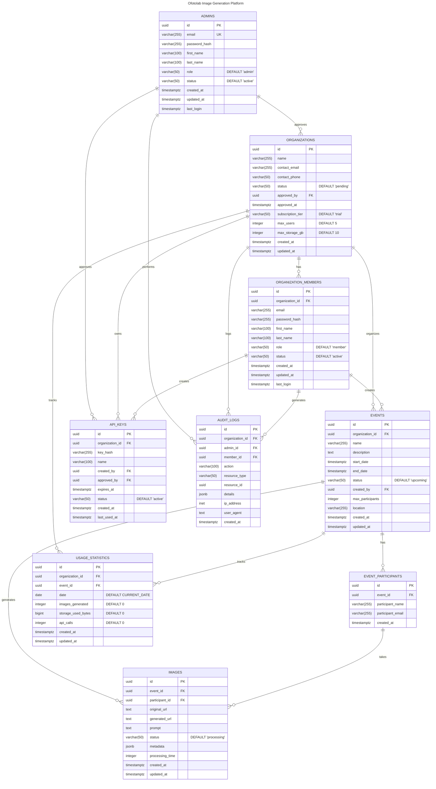

# Ofotolab Image Generation Platform Database Schema

## Database Diagram

## Overview
A B2B platform for managing AI-powered image generation events. Platform administrators approve organizations, which can then create events where participants can generate AI-enhanced photos.

## Platform Administration

### Administrators (`admins`)
Platform administrators who manage organization approvals and platform access.

| Column | Type | Constraints | Description |
|--------|------|-------------|-------------|
| `id` | UUID | PK, DEFAULT uuid_generate_v4() | Unique identifier |
| `email` | varchar(255) | NOT NULL, UNIQUE | Admin login email |
| `password_hash` | varchar(255) | NOT NULL | Hashed password |
| `first_name` | varchar(100) | | First name |
| `last_name` | varchar(100) | | Last name |
| `role` | varchar(50) | NOT NULL, DEFAULT 'admin' | Admin role |
| `status` | varchar(50) | NOT NULL, DEFAULT 'active' | Status: active, inactive |
| `created_at` | timestamptz | DEFAULT CURRENT_TIMESTAMP | Creation timestamp |
| `updated_at` | timestamptz | DEFAULT CURRENT_TIMESTAMP | Last update timestamp |
| `last_login` | timestamptz | | Last login time |

**Indexes:**
- `email` (for login and uniqueness)

## Client Organizations

### Organizations (`organizations`)
B2B clients that use the platform for events.

| Column | Type | Constraints | Description |
|--------|------|-------------|-------------|
| `id` | UUID | PK, DEFAULT uuid_generate_v4() | Unique identifier |
| `name` | varchar(255) | NOT NULL | Organization name |
| `contact_email` | varchar(255) | NOT NULL | Primary contact email |
| `contact_phone` | varchar(50) | | Contact phone number |
| `status` | varchar(50) | NOT NULL, DEFAULT 'pending' | Status: pending, active, suspended |
| `approved_by` | UUID | FK → admins.id | Approving administrator |
| `approved_at` | timestamptz | | Approval timestamp |
| `subscription_tier` | varchar(50) | DEFAULT 'trial' | Tier: trial, basic, premium, enterprise |
| `max_users` | integer | DEFAULT 5 | Maximum allowed team members |
| `max_storage_gb` | integer | DEFAULT 10 | Storage quota in gigabytes |
| `created_at` | timestamptz | DEFAULT CURRENT_TIMESTAMP | Creation timestamp |
| `updated_at` | timestamptz | DEFAULT CURRENT_TIMESTAMP | Last update timestamp |

**Indexes:**
- `status` (for filtering organizations)
- `approved_by` (for admin tracking)

### Organization Members (`organization_members`)
Staff members of client organizations.

| Column | Type | Constraints | Description |
|--------|------|-------------|-------------|
| `id` | UUID | PK, DEFAULT uuid_generate_v4() | Unique identifier |
| `organization_id` | UUID | FK → organizations.id, NOT NULL | Parent organization |
| `email` | varchar(255) | NOT NULL | Login email |
| `password_hash` | varchar(255) | NOT NULL | Hashed password |
| `first_name` | varchar(100) | | First name |
| `last_name` | varchar(100) | | Last name |
| `role` | varchar(50) | NOT NULL, DEFAULT 'member' | Role: owner, manager, member |
| `status` | varchar(50) | NOT NULL, DEFAULT 'active' | Status: active, inactive, suspended |
| `created_at` | timestamptz | DEFAULT CURRENT_TIMESTAMP | Creation timestamp |
| `updated_at` | timestamptz | DEFAULT CURRENT_TIMESTAMP | Last update timestamp |
| `last_login` | timestamptz | | Last login time |

**Indexes:**
- `organization_id` (for org filtering)
- `(organization_id, email)` (unique constraint)

## Event Management

### Events (`events`)
Photo session events organized by client organizations.

| Column | Type | Constraints | Description |
|--------|------|-------------|-------------|
| `id` | UUID | PK, DEFAULT uuid_generate_v4() | Unique identifier |
| `organization_id` | UUID | FK → organizations.id, NOT NULL | Parent organization |
| `name` | varchar(255) | NOT NULL | Event name |
| `description` | text | | Event description |
| `start_date` | timestamptz | NOT NULL | Event start time |
| `end_date` | timestamptz | NOT NULL | Event end time |
| `status` | varchar(50) | NOT NULL, DEFAULT 'upcoming' | Status: upcoming, ongoing, completed, cancelled |
| `created_by` | UUID | FK → organization_members.id, NOT NULL | Creating member |
| `max_participants` | integer | | Optional attendee limit |
| `location` | varchar(255) | | Physical/virtual location |
| `created_at` | timestamptz | DEFAULT CURRENT_TIMESTAMP | Creation timestamp |
| `updated_at` | timestamptz | DEFAULT CURRENT_TIMESTAMP | Last update timestamp |

**Indexes:**
- `organization_id` (for org filtering)
- `status` (for status filtering)
- `created_by` (for creator tracking)

### Event Participants (`event_participants`)
Attendees who participate in photo sessions.

| Column | Type | Constraints | Description |
|--------|------|-------------|-------------|
| `id` | UUID | PK, DEFAULT uuid_generate_v4() | Unique identifier |
| `event_id` | UUID | FK → events.id, NOT NULL | Parent event |
| `participant_name` | varchar(255) | NOT NULL | Participant's name |
| `participant_email` | varchar(255) | | Optional email |
| `created_at` | timestamptz | DEFAULT CURRENT_TIMESTAMP | Creation timestamp |

**Indexes:**
- `event_id` (for event filtering)

### Images (`images`)
Original and AI-generated images from events.

| Column | Type | Constraints | Description |
|--------|------|-------------|-------------|
| `id` | UUID | PK, DEFAULT uuid_generate_v4() | Unique identifier |
| `event_id` | UUID | FK → events.id, NOT NULL | Parent event |
| `participant_id` | UUID | FK → event_participants.id, NOT NULL | Creating participant |
| `original_url` | text | NOT NULL | Original photo URL |
| `generated_url` | text | | AI-generated photo URL |
| `prompt` | text | | AI generation prompt |
| `status` | varchar(50) | NOT NULL, DEFAULT 'processing' | Status: processing, completed, failed |
| `metadata` | jsonb | | Image and AI properties |
| `processing_time` | integer | | Duration in milliseconds |
| `created_at` | timestamptz | DEFAULT CURRENT_TIMESTAMP | Creation timestamp |
| `updated_at` | timestamptz | DEFAULT CURRENT_TIMESTAMP | Last update timestamp |

**Indexes:**
- `event_id` (for event filtering)
- `participant_id` (for participant filtering)
- `status` (for status filtering)

## Security & Monitoring

### API Keys (`api_keys`)
Authentication keys for programmatic access.

| Column | Type | Constraints | Description |
|--------|------|-------------|-------------|
| `id` | UUID | PK, DEFAULT uuid_generate_v4() | Unique identifier |
| `organization_id` | UUID | FK → organizations.id, NOT NULL | Parent organization |
| `key_hash` | varchar(255) | NOT NULL | Hashed API key |
| `name` | varchar(100) | NOT NULL | Key identifier |
| `created_by` | UUID | FK → organization_members.id, NOT NULL | Creating member |
| `approved_by` | UUID | FK → admins.id, NOT NULL | Approving administrator |
| `expires_at` | timestamptz | | Optional expiration |
| `status` | varchar(50) | NOT NULL, DEFAULT 'active' | Status: active, revoked |
| `created_at` | timestamptz | DEFAULT CURRENT_TIMESTAMP | Creation timestamp |
| `last_used_at` | timestamptz | | Last usage time |

**Indexes:**
- `organization_id` (for org filtering)
- `key_hash` (for authentication)
- `status` (for status filtering)

### Usage Statistics (`usage_statistics`)
Daily resource usage tracking for billing.

| Column | Type | Constraints | Description |
|--------|------|-------------|-------------|
| `id` | UUID | PK, DEFAULT uuid_generate_v4() | Unique identifier |
| `organization_id` | UUID | FK → organizations.id, NOT NULL | Parent organization |
| `event_id` | UUID | FK → events.id | Optional event link |
| `date` | date | NOT NULL, DEFAULT CURRENT_DATE | Stats date |
| `images_generated` | integer | DEFAULT 0 | Daily image count |
| `storage_used_bytes` | bigint | DEFAULT 0 | Storage consumption |
| `api_calls` | integer | DEFAULT 0 | API usage count |
| `created_at` | timestamptz | DEFAULT CURRENT_TIMESTAMP | Creation timestamp |
| `updated_at` | timestamptz | DEFAULT CURRENT_TIMESTAMP | Last update timestamp |

**Indexes:**
- `organization_id` (for org filtering)
- `date` (for date filtering)
- `(organization_id, date)` (for daily org stats)

### Audit Logs (`audit_logs`)
Security audit trail for compliance.

| Column | Type | Constraints | Description |
|--------|------|-------------|-------------|
| `id` | UUID | PK, DEFAULT uuid_generate_v4() | Unique identifier |
| `organization_id` | UUID | FK → organizations.id | Related organization |
| `admin_id` | UUID | FK → admins.id | Acting administrator |
| `member_id` | UUID | FK → organization_members.id | Acting org member |
| `action` | varchar(100) | NOT NULL | Action performed |
| `resource_type` | varchar(50) | NOT NULL | Target resource type |
| `resource_id` | UUID | | Target resource ID |
| `details` | jsonb | | Additional context |
| `ip_address` | inet | | Source IP |
| `user_agent` | text | | Browser/client info |
| `created_at` | timestamptz | DEFAULT CURRENT_TIMESTAMP | Creation timestamp |

**Indexes:**
- `organization_id` (for org filtering)
- `admin_id` (for admin filtering)
- `member_id` (for member filtering)
- `created_at` (for timeline queries)

## Key Relationships

### Administrative Control
- Admin `1:N` Organizations (approval relationship)
- Admin `1:N` API Keys (approval relationship)

### Organization Structure
- Organization `1:N` Members (cascade delete)
- Organization `1:N` Events (cascade delete)
- Organization `1:N` API Keys (cascade delete)
- Organization `1:N` Usage Stats (cascade delete)

### Event Management
- Event `1:N` Participants (cascade delete)
- Event `1:N` Images (cascade delete)
- Event `1:N` Usage Stats (set null on delete)
- Organization Member `1:N` Events (created_by)

### Security Tracking
- Organization Member `1:N` API Keys (created_by)
- Admin/Member/Organization → Audit Logs (tracking relationships)

## Automatic Updates
All tables with `updated_at` columns have triggers to automatically update the timestamp on record modification:
- organizations
- organization_members
- events
- images
- usage_statistics
