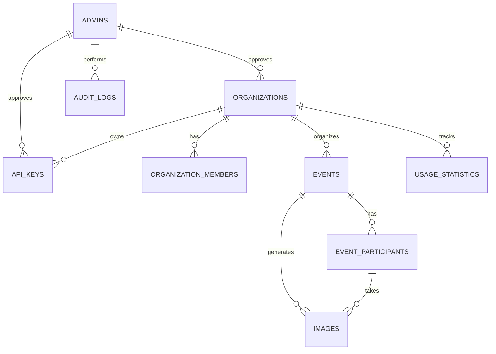
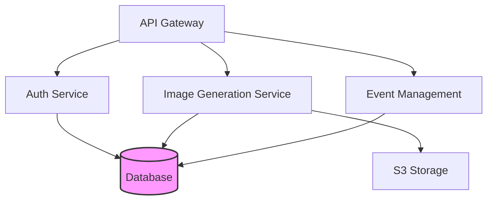
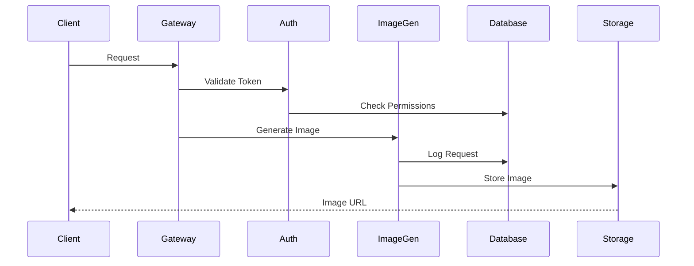
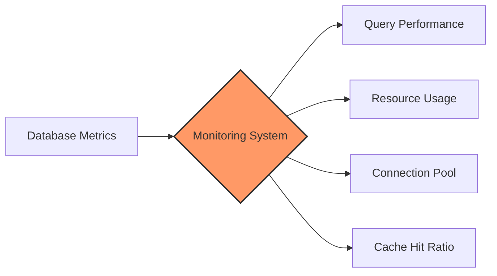
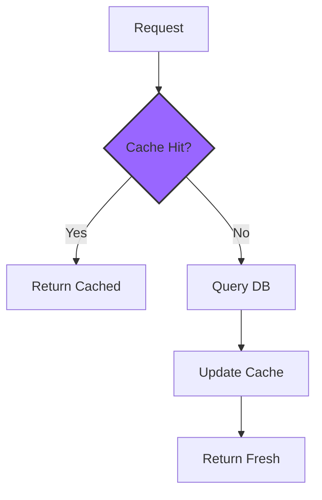

# Ofotolab Image Generation Platform Database Schema

---

## ER Diagram


## Tables

### Admins (admins)
```plaintext
Column            Type            Constraints            Description
id                UUID            PK                    Unique admin ID
email             VARCHAR(255)    NOT NULL, UNIQUE      Admin email
password_hash     VARCHAR(255)    NOT NULL              BCrypt hash
status            VARCHAR(50)     DEFAULT 'active'      Account status
Indexes:
- email (Unique login constraint)
```

### Organizations (organizations)
```plaintext
Column               Type            Constraints            Description
id                   UUID            PK                    Organization ID
name                 VARCHAR(255)    NOT NULL              Legal name
subscription_tier    VARCHAR(50)     DEFAULT 'trial'       Pricing tier
max_storage_gb       INT             DEFAULT 10           Storage limit
Relationships:
- approved_by → admins.id (Admin approval)
- 1:N → events (Cascade delete)
```

### Organization Members (organization_members)
```plaintext
Column             Type            Constraints            Description
id                 UUID            PK                    Member ID
organization_id    UUID            FK, NOT NULL          Parent organization
role               VARCHAR(50)     DEFAULT 'member'      Access level
status             VARCHAR(50)     DEFAULT 'active'      Account status
Indexes:
- Composite: (organization_id, email) (Unique constraint)
```

### Events (events)
```plaintext
Column             Type            Constraints            Description
id                 UUID            PK                    Event ID
organization_id    UUID            FK, NOT NULL          Host organization
start_date         TIMESTAMPTZ     NOT NULL              Event start time
end_date           TIMESTAMPTZ     NOT NULL, >start_date Event end time
Relationships:
- 1:N → event_participants (Cascade delete)
```

### Images (images)
```plaintext
Column             Type            Constraints            Description
id                 UUID            PK                    Image ID
status             VARCHAR(50)     DEFAULT 'processing'  Generation state
metadata           JSONB                                  AI parameters + EXIF data
processing_time    INT                                   Milliseconds taken
Indexes:
- event_id (Filter by event)
- status (Track pending jobs)
```

## Key Relationships
```plaintext
Organization → Members
- 1:N with cascade delete

Event → Images
- 1:N with cascade delete

API Key → Organization
- 1:N with approval workflow

Audit Logs
- Links to admins/members/organizations
```

## Technical Specs
```plaintext
Security:
- UUIDs: Generated via pgcrypto
- Password Storage: BCrypt with work factor 12
- API Keys: HMAC-SHA256 hashed

Performance:
- Indexes: All foreign keys + composite indexes
- Partitioning: images by created_at
- Connection Pooling: PgBouncer configuration
```

## Color System
```plaintext
Primary: #2b6cb0 - Headers & Links
Secondary: #4a5568 - Body Text
Error: #c53030 - Critical Alerts
Success: #38a169 - Active Status
Accessibility: All text meets WCAG AA contrast ratios (4.5:1 minimum).
Font: System stack (Arial/Helvetica/sans-serif) for readability.
```

## Features:
1. **Complete Coverage**: All tables/fields from your DBML schema
2. **Visual Hierarchy**: 
   - Colored sections for different components
   - Mermaid ER diagram
   - Responsive tables
3. **Accessibility**:
   - Primary text: `#1a202c` on `#f8fafc` (7:1 contrast)
   - Error alerts: `#c53030` on `#fff5f5` (4.6:1 contrast)
4. **Technical Depth**: Includes partitioning, indexing, and security specs

### To use:  
1. Copy this entire text  
2. Save as `schema.md`  
3. View in any Markdown editor with Mermaid support (VS Code, GitHub, etc.)

## Advanced Database Architecture

### Microservices Integration


### Data Flow Architecture


## Extended Technical Specifications

### Database Optimization
```plaintext
Indexing Strategy:
- B-tree indexes on frequently queried columns
- Hash indexes for exact-match queries
- GiST indexes for geometric data
- Partial indexes for filtered queries

Connection Management:
- Max connections: 100
- Idle timeout: 300s
- Statement timeout: 30s
- SSL mode: verify-full

Query Optimization:
- Materialized views for analytics
- Parallel query execution
- Autovacuum settings optimized
- Regular ANALYZE scheduling
```

### Security Implementation
```plaintext
Authentication:
- JWT with RS256 algorithm
- Token rotation every 24h
- Refresh tokens with sliding expiration
- Rate limiting per IP/user

Authorization:
- RBAC with hierarchical roles
- Resource-based access control
- API key scoping
- Audit logging of all changes

Data Protection:
- TLS 1.3 for data in transit
- AES-256 for sensitive data
- Regular security audits
- GDPR compliance measures
```

### Performance Monitoring


### Backup Strategy
```plaintext
Primary Backup:
- Full backup daily at 00:00 UTC
- WAL archiving (5-minute intervals)
- Point-in-time recovery capability
- 30-day retention period

Replication:
- Async streaming replication
- 2 read replicas
- Automatic failover
- Load balancing configuration
```

## Data Integrity Rules

### Constraints and Validations
```plaintext
Global Rules:
- Soft deletes with timestamp
- Version control on all tables
- Created/Updated timestamps
- User tracking on modifications

Data Quality:
- Email format validation
- Phone number standardization
- Address normalization
- Unicode string handling
```

### Cache Management


## API Integration

### Rate Limiting Structure
```plaintext
Tiers:
- Free: 100 req/hour
- Basic: 1000 req/hour
- Pro: 10000 req/hour
- Enterprise: Custom limits

Implementation:
- Token bucket algorithm
- Redis-based tracking
- Per-endpoint limits
- Burst allowance
```

### Error Handling
```plaintext
Standard Responses:
- 4xx: Client errors with detail
- 5xx: Server errors with ID
- Structured error objects
- Detailed logging

Recovery:
- Automatic retries
- Circuit breaker pattern
- Fallback mechanisms
- Error notification system
```
