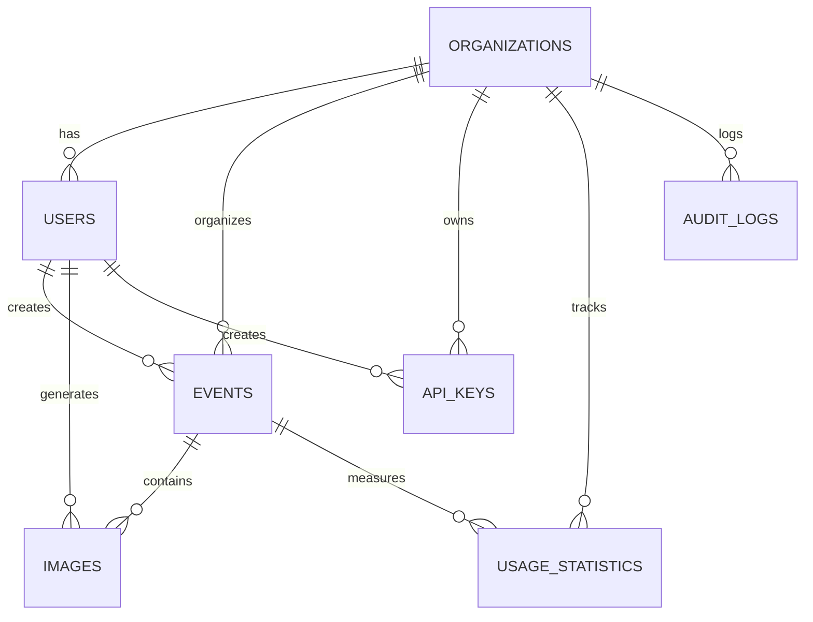

# Database Schema Visualization

## Table Relationships Overview


## Detailed Table Structure

### 🏢 Organizations
```
┌─────────────────────┐
│    organizations    │
├─────────────────────┤
│ ★ id (UUID)        │
│ • name             │
│ • status           │
│ • subscription_tier │
│ • max_users        │
│ • max_storage_gb   │
│ • created_at       │
│ • updated_at       │
└─────────────────────┘
```

### 👤 Users
```
┌──────────────────────┐
│        users         │
├──────────────────────┤
│ ★ id (UUID)         │
│ ⚡ organization_id   │
│ • email             │
│ • password_hash     │
│ • first_name        │
│ • last_name         │
│ • role              │
│ • status           │
│ • last_login        │
│ • created_at        │
│ • updated_at        │
└──────────────────────┘
```

### 📅 Events
```
┌──────────────────────┐
│       events         │
├──────────────────────┤
│ ★ id (UUID)         │
│ ⚡ organization_id   │
│ ⚡ created_by       │
│ • name              │
│ • description       │
│ • start_date        │
│ • end_date          │
│ • status            │
│ • max_participants  │
│ • location          │
│ • created_at        │
│ • updated_at        │
└──────────────────────┘
```

### 🖼️ Images
```
┌──────────────────────┐
│       images         │
├──────────────────────┤
│ ★ id (UUID)         │
│ ⚡ event_id         │
│ ⚡ organization_id   │
│ ⚡ created_by       │
│ • original_url      │
│ • generated_url     │
│ • prompt            │
│ • status            │
│ • metadata          │
│ • processing_time   │
│ • created_at        │
│ • updated_at        │
└──────────────────────┘
```

### 🔑 API Keys
```
┌──────────────────────┐
│      api_keys        │
├──────────────────────┤
│ ★ id (UUID)         │
│ ⚡ organization_id   │
│ ⚡ created_by       │
│ • key_hash          │
│ • name              │
│ • expires_at        │
│ • last_used_at      │
│ • status            │
│ • created_at        │
└──────────────────────┘
```

### 📊 Usage Statistics
```
┌──────────────────────┐
│  usage_statistics    │
├──────────────────────┤
│ ★ id (UUID)         │
│ ⚡ organization_id   │
│ ⚡ event_id         │
│ • date              │
│ • images_generated  │
│ • storage_used_bytes│
│ • api_calls         │
│ • created_at        │
│ • updated_at        │
└──────────────────────┘
```

### 📝 Audit Logs
```
┌──────────────────────┐
│     audit_logs       │
├──────────────────────┤
│ ★ id (UUID)         │
│ ⚡ organization_id   │
│ ⚡ user_id          │
│ • action            │
│ • resource_type     │
│ • resource_id       │
│ • details           │
│ • ip_address        │
│ • user_agent        │
│ • created_at        │
└──────────────────────┘
```

## Legend
- ★ Primary Key
- ⚡ Foreign Key
- • Regular Field

## Key Relationships

### Organization-centric
- Organization → Users (1:Many)
- Organization → Events (1:Many)
- Organization → API Keys (1:Many)
- Organization → Usage Statistics (1:Many)

### Event-centric
- Event → Images (1:Many)
- Event → Usage Statistics (1:Many)

### User-centric
- User → Events (1:Many, as creator)
- User → Images (1:Many, as creator)
- User → API Keys (1:Many, as creator)

## Data Flow
1. Organization is created
2. Users are added to organization
3. Events are created by users
4. Images are generated during events
5. Usage is tracked per organization/event
6. All actions are logged in audit_logs

## Cascade Delete Rules
- Organization deletion cascades to:
  - Users
  - Events
  - API Keys
  - Usage Statistics
  - Audit Logs
- Event deletion cascades to:
  - Images
  - Related usage statistics
