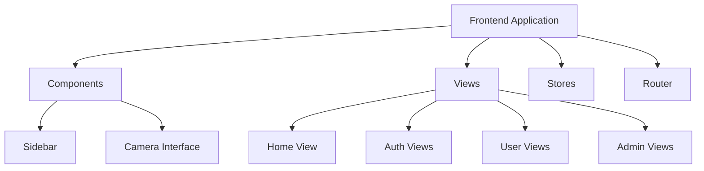
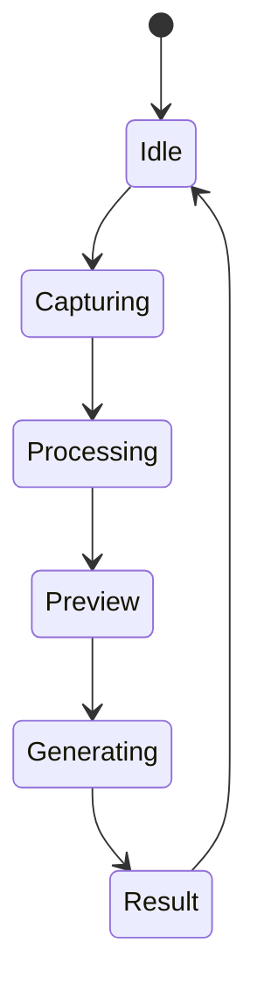
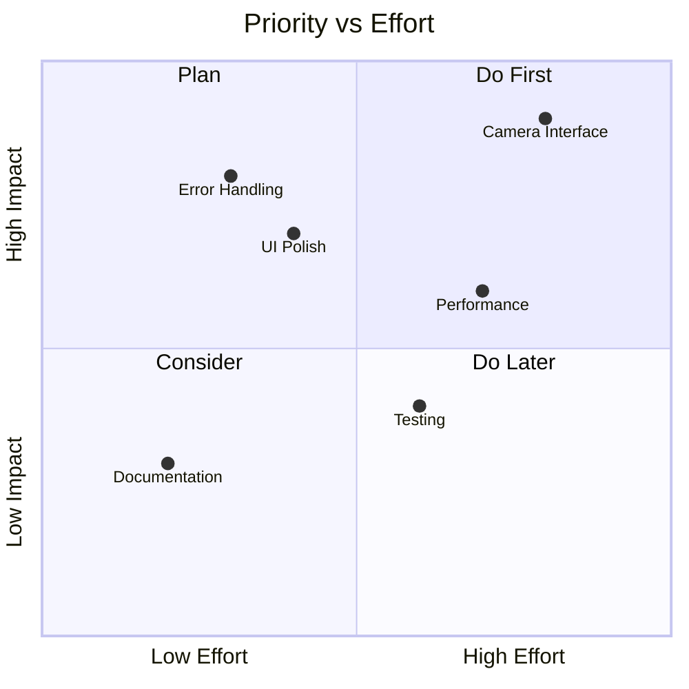

# Frontend Advancement Tasks

## Project Analysis 📊



## Current Structure
- Vue 3 application with Vite
- TailwindCSS for styling
- Firebase integration
- Vue Router for navigation
- Pinia for state management

## Enhancement Tasks

### 1. User Experience Improvements 🎨

#### Camera Interface Enhancement
- [ ] Add real-time preview filters
- [ ] Implement image cropping functionality
- [ ] Add image adjustment controls (brightness, contrast)
- [ ] Create loading animations for processing state
- [ ] Add guide overlay for optimal face positioning

#### Model Selection Interface
- [ ] Create a carousel of model previews
- [ ] Add model comparison view
- [ ] Implement favorite models feature
- [ ] Add model description tooltips
- [ ] Create model-specific settings panels

### 2. Error Handling & Feedback 🛠️

- [ ] Implement comprehensive error boundary components
- [ ] Create meaningful error messages for common scenarios
- [ ] Add retry mechanisms for failed operations
- [ ] Implement offline mode detection
- [ ] Add visual feedback for processing states

### Detailed Error Handling Implementation Plan

#### 1. Global Error Handler Setup
**Location**: `src/utils/errorHandler.js` (New file)
```javascript
// Implementation of centralized error handling
// Will include error categorization, logging, and user-friendly messages
```

#### 2. API Error Handling
**Files to Modify**:
- `src/stores/auth.js`: Add try-catch blocks for authentication operations
- Any API call components: Implement consistent error handling pattern

#### 3. Component-Level Error Boundaries
**Location**: `src/components/ErrorBoundary.vue` (New file)
- Will catch and handle rendering errors
- Will provide fallback UI for component failures

#### 4. Toast Notification Integration
**Current Setup**: Already available via vue-toast-notification
**Enhancement Locations**:
- `src/main.js`: Add default toast configuration
- Create utility function for consistent toast styling

#### 5. Implementation Steps

1. **Create Global Error Handler**
```javascript
// src/utils/errorHandler.js
export const handleError = (error, context = '') => {
  // Log error
  console.error(`[${context}]`, error);
  
  // User-friendly message
  const message = getUserFriendlyMessage(error);
  
  // Show toast
  useToast().error(message);
  
  // Optional: Report to error tracking service
};
```

2. **Add Error Boundary Component**
```vue
// src/components/ErrorBoundary.vue
<template>
  <slot v-if="!error" />
  <div v-else class="error-boundary">
    <h3>Something went wrong</h3>
    <button @click="resetError">Try Again</button>
  </div>
</template>
```

3. **Enhance Store Error Handling**
In auth store and other stores:
```javascript
try {
  // operation
} catch (error) {
  handleError(error, 'Authentication');
  throw error; // If needed upstream
}
```

4. **Form Validation Errors**
Add to form components:
```javascript
const handleSubmitError = (error) => {
  if (error.validation) {
    // Handle validation errors
    return handleValidationError(error);
  }
  // Handle other errors
  return handleError(error, 'Form Submission');
};
```

#### 6. Files to Modify

1. **src/main.js**
Add lines after ToastPlugin initialization:
```javascript
app.use(ToastPlugin, {
  position: 'top-right',
  duration: 3000,
  dismissible: true
});
```

2. **src/stores/auth.js**
Add error handling to authentication operations

3. **src/components/**
Add ErrorBoundary wrapper to critical components

#### 7. Error Categories to Handle

1. **Network Errors**
- API timeouts
- Connection failures
- Server errors (500 range)

2. **Authentication Errors**
- Invalid credentials
- Session expiration
- Permission denied

3. **Validation Errors**
- Form input errors
- File upload issues
- Invalid data formats

4. **Runtime Errors**
- Component rendering failures
- JavaScript execution errors
- Resource loading failures

#### 8. Implementation Priority Order

1. Global error handler setup
2. Authentication error handling
3. API error handling
4. Form validation error handling
5. Component error boundaries

#### 9. Testing Scenarios

- Network disconnection handling
- Invalid API responses
- Component failure recovery
- Form validation error display
- Authentication error flows

This error handling implementation will provide:
- Consistent error reporting
- User-friendly error messages
- Proper error logging
- Graceful degradation
- Easy maintenance and debugging

### 3. Performance Optimization ⚡

- [ ] Implement lazy loading for components
- [ ] Add image optimization
- [ ] Implement virtual scrolling for image galleries
- [ ] Add service worker for offline capabilities
- [ ] Optimize component re-renders

### 4. State Management Enhancement 📦



- [ ] Create dedicated stores for:
  - User preferences
  - Model settings
  - Image history
  - Processing queue
  - Application settings

### 5. Testing & Quality Assurance 🧪

- [ ] Set up unit testing framework
- [ ] Add component tests
- [ ] Implement E2E tests
- [ ] Add performance monitoring
- [ ] Create test scenarios for offline functionality

### 6. UI/UX Polish ✨

#### Color Scheme
```css
/* High Contrast Color Palette */
--primary: #2563eb;     /* Accessible blue */
--secondary: #4f46e5;   /* Deep purple */
--accent: #f59e0b;      /* Warm amber */
--text: #1f2937;       /* Dark gray for text */
--background: #ffffff;  /* Clean white */
--error: #dc2626;      /* Vibrant red */
--success: #059669;    /* Rich green */
```

#### Accessibility Improvements
- [ ] Implement ARIA labels
- [ ] Add keyboard navigation
- [ ] Ensure proper color contrast (WCAG 2.1)
- [ ] Add screen reader support
- [ ] Implement reduced motion options

### 7. Cloud Preparation 🌩️

- [ ] Add environment configuration
- [ ] Implement feature flags
- [ ] Create deployment scripts
- [ ] Add monitoring hooks
- [ ] Implement caching strategies

### 8. Documentation 📚

- [ ] Create component documentation
- [ ] Add API integration guides
- [ ] Document state management patterns
- [ ] Create deployment guide
- [ ] Add contribution guidelines

## Priority Matrix



## Implementation Notes

1. All new components should follow Vue 3's Composition API
2. Follow atomic design principles
3. Implement mobile-first responsive design
4. Maintain consistent error handling patterns

## Getting Started

1. Choose a task from the priority matrix
2. Create a new feature branch
3. Implement the feature with tests
4. Document changes
5. Create a pull request

Remember to maintain consistent code style and follow the existing project patterns while implementing these enhancements.
