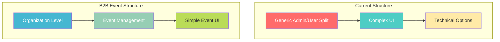
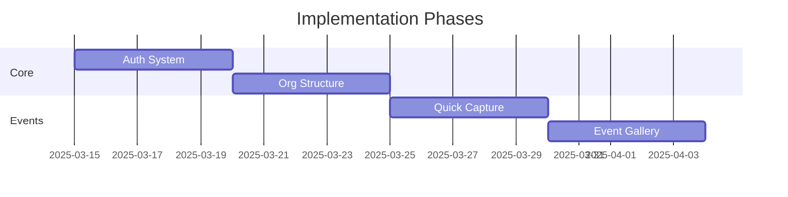

# B2B Event-Focused UI Enhancement Plan 🎨

## Current vs. Proposed Architecture 🏗️



## Vue 3 Component Implementation 📝

### 1. Event Capture Component (Vue 3 Style)
```vue
<!-- src/views/event/EventCapture.vue -->
<script>
export default {
  name: 'EventCapture',
  data() {
    return {
      capture_settings: {
        event_id: null,
        organization_id: null
      }
    }
  },
  methods: {
    handle_capture() {
      // Simplified capture method
    }
  }
}
</script>

<template>
  <div class="event-capture">
    <event-header />
    <quick-capture-panel />
    <event-gallery />
  </div>
</template>
```

### 2. Organization Store (Pinia)
```javascript
// src/stores/organization.js
import { defineStore } from 'pinia'

export const useOrganizationStore = defineStore('organization', {
  state: () => ({
    current_organization: null,
    active_events: []
  }),
  actions: {
    async fetch_organization_data() {
      // Implementation
    }
  }
})
```

## Required Changes by Component 🔧

### 1. Authentication Update
```javascript
// src/stores/auth.js
export const useAuthStore = defineStore('auth', {
  state: () => ({
    user: null,
    organization_id: null,
    role: null
  })
})
```

### 2. Event Store
```javascript
// src/stores/event.js
export const useEventStore = defineStore('event', {
  state: () => ({
    current_event: null,
    attendees: [],
    photos: []
  })
})
```

## File Structure Changes 📂

```plaintext
frontend/
├── src/
│   ├── components/
│   │   ├── event/
│   │   │   ├── QuickCapture.vue
│   │   │   └── EventHeader.vue
│   │   └── organization/
│   │       ├── OrgDashboard.vue
│   │       └── EventManager.vue
│   ├── views/
│   │   ├── event/
│   │   │   ├── CaptureMode.vue
│   │   │   └── Gallery.vue
│   │   └── organization/
│   │       ├── Dashboard.vue
│   │       └── Events.vue
│   └── stores/
       ├── organization.js
       ├── event.js
       └── auth.js
```

## Implementation Priority 📊



## Component Guidelines 🎯

### Event Mode Component
```vue
<!-- src/components/event/QuickCapture.vue -->
<script>
export default {
  name: 'QuickCapture',
  data() {
    return {
      camera_active: false,
      preview_image: null
    }
  },
  methods: {
    start_camera() {
      // Implementation
    },
    capture_photo() {
      // Implementation
    }
  }
}
</script>
```

## Style Guide (WCAG 2.1 Compliant) 🎨

```css
:root {
  /* Primary Colors */
  --primary: #2c3e50;     /* High contrast for text */
  --secondary: #3498db;   /* Accessible blue */
  --accent: #27ae60;      /* Success green */
  
  /* Text Colors */
  --text-dark: #2c3e50;   /* For light backgrounds */
  --text-light: #ecf0f1;  /* For dark backgrounds */
  
  /* Background Colors */
  --bg-primary: #ffffff;
  --bg-secondary: #f8f9fa;
}
```

## Error Handling 🚨

```javascript
// src/utils/errorHandler.js
export const handleError = (error, component) => {
  console.error(`Error in ${component}:`, error)
  // Error logging implementation
}
```

## Testing Structure 🧪

```javascript
// tests/components/QuickCapture.spec.js
import { mount } from '@vue/test-utils'
import QuickCapture from '@/components/event/QuickCapture.vue'

describe('QuickCapture', () => {
  test('initializes camera correctly', () => {
    // Test implementation
  })
})
```

## Security Implementation 🔒

```javascript
// src/utils/auth.js
export const checkEventAccess = async (eventId) => {
  // Implementation of event access verification
}
```

## Next Steps 👣

1. **Phase 1: Core Updates**
   - Update authentication system
   - Implement organization structure
   - Create base components

2. **Phase 2: Event Features**
   - Build quick capture mode
   - Create event galleries
   - Add real-time updates

3. **Phase 3: Organization Tools**
   - Implement event management
   - Add staff controls
   - Create analytics dashboard

## Notes 📝

- All components follow Vue 3 composition API
- Snake_case used for variables
- PascalCase for components
- Comprehensive error handling
- Mobile-first design
- WCAG 2.1 compliance
- Performance optimized
- Secure by default
